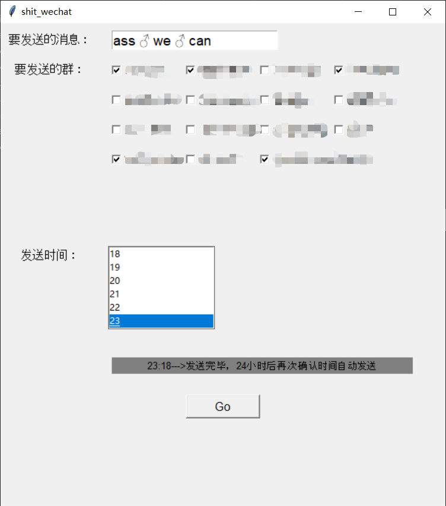

<h1>微信群消息定时发送器</h1>

### 1: 环境要求

>wxpy

### 2: 流程：

>启动程序后会自动弹出二维码，手机微信扫码即可登录，注意：此脚本使用网页微信接口，但部分微信账号无法登录网页版微信，可到 [网页微信](https://wx.qq.com)查看本账号是否支持。
>
>输入要发送消息，选择要发送的群，设定发送时间，点击Go即可发送。
>
>
>
>如果未到发送时间，程序自动一小时后再次确认时间尝试发送。
>
>当满足预设时间时，自动发送消息，24小时后再次确认时间尝试发送。
>
>点击Go按钮后，无需其他操作，将脚本后台运行即可。
>
>运行日志保存在：wechat_group.log中。

### 3： 其他：

>本脚本支持封装为exe文件，安装pyinstaller后，在终端进入shit_wechat.py同级目录，执行 pyinstaller -F -w shit_wechat.py,生成文件保存在：dist目录下。